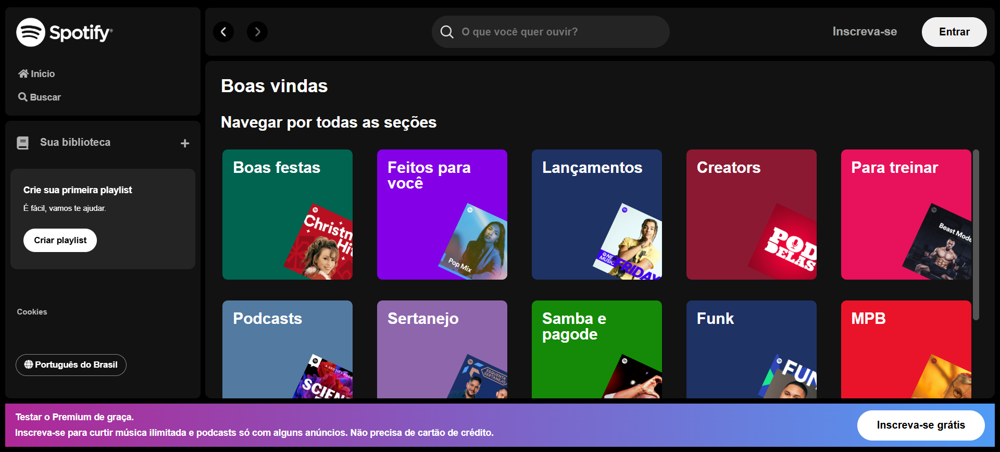

# 🎵 Spotify Imersão Alura

Bem-vindo ao **Spotify Imersão Alura**! Este projeto foi desenvolvido durante a imersão promovida pela **Alura** entre os dias 24/01/2025 a 04/02/2025, onde exploramos tecnologias web para criar uma aplicação inspirada no Spotify.

## 📌 Sobre o Projeto

O projeto consiste em uma aplicação web que simula algumas funcionalidades do Spotify, como:

- 🔍 Busca de artistas
- 🎶 Exibição de playlists
- 🖼️ Exibição de detalhes do artista (imagem, nome, etc.)
- ⚡ Interface dinâmica com gerenciamento de componentes e estado utilizando React

## 🚀 Tecnologias Utilizadas

- **REACT** →  → Framework JavaScript para construir interfaces de usuário dinâmicas e componentes reutilizáveis.
- **CSS**  → Estilização da interface e layout.
- **JavaScript** → Linguagem utilizada para a lógica do projeto e interação com os componentes.
- **React Router** → Navegação entre diferentes páginas ou seções da aplicação.
Context API ou Hooks (useState, useEffect, etc.) → Gerenciamento de estado e lógica de componentes.

## 📂 Estrutura do Projeto

````
spotify-react-imersao-alura/
│
├── node_modules/        # Dependências do projeto (instaladas via npm)
├── public/              # Arquivos públicos (index.html, favicon.ico, etc.)
├── src/                 # Código-fonte da aplicação
│   ├── api-artists/     # Contém dados dos artistas (JSON)
│   │   └── artists.json
│   ├── assets/          # Arquivos de mídia e ícones
│   │   ├── icons/       # Ícones utilizados na aplicação
│   │   └── playlists/   # Imagens dos álbuns dos cantores
│   ├── components/      # Componentes reutilizáveis da aplicação
│   │   ├── Footer/      # Componente Footer
│   │   │   ├── Footer.css
│   │   │   └── Footer.js
│   │   ├── Header/      # Componente Header
│   │   │   ├── Header.css
│   │   │   └── Header.js
│   │   ├── Sidebar/     # Componente Sidebar
│   │   │   ├── Sidebar.css
│   │   │   └── Sidebar.js
│   │   └── Main/        # Componente Main
│   │       ├── Main.css
│   │       └── Main.js
│   ├── styles/          # Estilos globais e variáveis CSS
│   │   ├── vars.css     # Variáveis CSS
│   │   └── reset.css    # Reset de estilos padrão
│   ├── App.css          # Estilos específicos para o App
│   ├── App.js           # Componente principal da aplicação
│   ├── index.css        # Estilos globais do projeto
│   ├── index.js         # Ponto de entrada para a aplicação
│   ├── reportWebVitals.js  # Arquivo relacionado a métricas de performance
│   ├── setupTests.js    # Configuração inicial para os testes
│   ├── App.test.js      # Testes relacionados ao App
│   └── logo.svg         # Logo da aplicação (ou ícone)
├── .gitignore           # Arquivos e pastas a serem ignorados pelo git
├── package-lock.json    # Dependências exatas do projeto
├── package.json         # Definição das dependências e scripts do projeto
└── README.md            # Documentação do projeto
````

## 📡 Como Executar o Projeto

1. Clone o repositório:
   ```sh
   git clone https://github.com/Audry-prog/spotify-react-imersao-alura.git
   ```
2. Acesse a pasta do projeto:
   ```sh
   cd spotify-react-imersao-alura
   ```
3. Instale as dependências do projeto utilizando o npm (ou yarn, se preferir):
   ```sh
   npm install
   ```
4. Inicie o servidor de desenvolvimento:
   ```sh
   npm start
   ```
Isso abrirá o projeto no seu navegador, geralmente acessando http://localhost:3000.

## 📢 Funcionalidades

✔️ Busca artistas por nome ✔️ Filtra artistas na API fake ✔️ Exibe informações detalhadas do artista ✔️ Alterna entre lista de artistas e detalhes ✔️ Estilização dinâmica baseada na interação do usuário

## 📷 Print da Tela do Projeto



## 📜 Licença

Este projeto foi desenvolvido para fins educacionais durante a imersão da Alura. Sinta-se à vontade para explorar. 🎵🚀

---

💡 **Dúvidas ou sugestões?** Contribua com o projeto ou entre em contato! 😃
